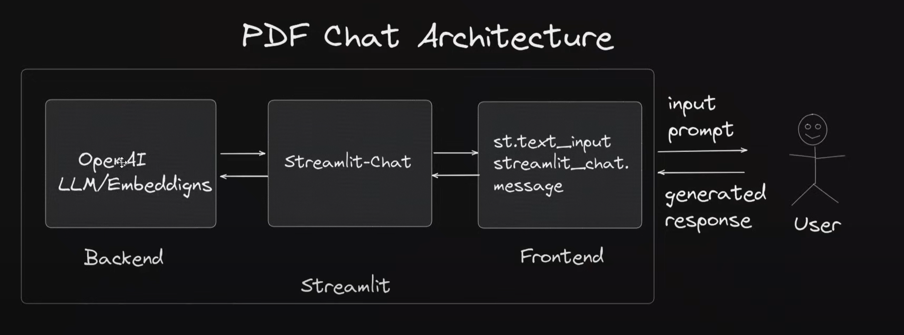
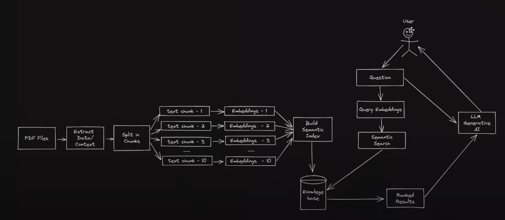

# PDF Chatbot

PDF chatbot is a simple application that allows you to chat with your own uploaded documents (pdfs)

## Architecture

The simple workflow the app is going to follow is represented in this diagram

Chatbot backend elaborated:

## Infrastructure

1. LLM - GPT/Ollama/Huggingface
2. UI - Streamlit

## Backend Logic

- Simple PDF chat application

    We upload the files -> Extract the text from the pdf -> chunk the text -> convert chunks into embeddings

    -> 

- Embedding Logic: 

    Embeddings are numbers that represent text.

    
    